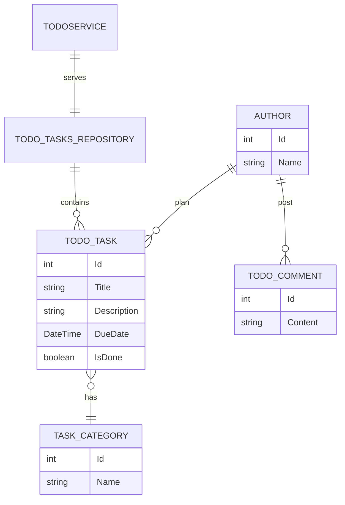

# ToDo Application
## Entity Relationship:

```mermaid
erDiagram
    TODOSERVICE ||--|| TODO_TASKS_REPOSITORY : serves
    TODO_TASKS_REPOSITORY ||--o{ TODO_TASK : contains
    TODO_TASK }o--|| TASK_CATEGORY: has

    AUTHOR ||--o{ TODO_TASK : plan
    AUTHOR ||--o{ TODO_COMMENT : post
    
    AUTHOR {
        int Id
        string Name
    }

    TODO_COMMENT {
        int Id
        string Content
        
    }

    TODO_TASK {
        int Id
        string Title
        string Description
        DateTime DueDate
        boolean IsDone
    }

    TASK_CATEGORY {
        int Id
        string Name
    }

```