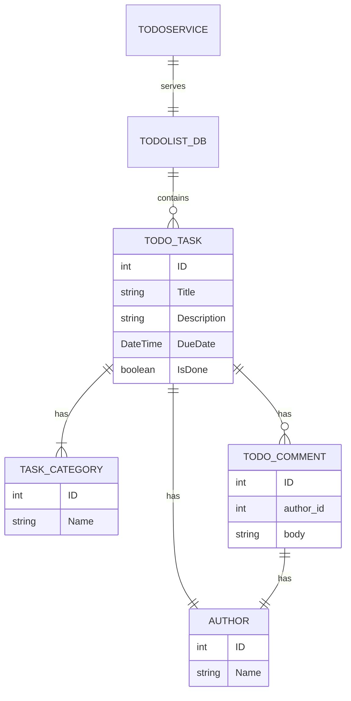

# ToDo Application
## Entity Relationship:

```mermaid
erDiagram
    TODOSERVICE ||--|| TODOLIST_DB : serves
    TODOLIST_DB ||--o{ TODO_TASK : contains
    TODO_TASK ||--|{ TASK_CATEGORY: has

    TODO_TASK ||--|| AUTHOR: has
    TODO_TASK ||--o{ TODO_COMMENT: has
    TODO_COMMENT ||--|| AUTHOR: has

    AUTHOR {
        int ID
        string Name
    }

    TODO_COMMENT {
        int ID
        int author_id
        string body
        
    }

    TODO_TASK {
        int ID
        string Title
        string Description
        DateTime DueDate
        boolean IsDone
    }

    TASK_CATEGORY {
        int ID
        string Name
    }

```